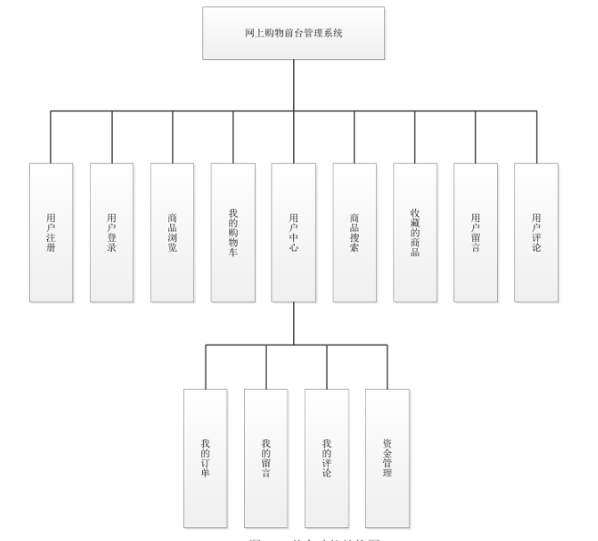
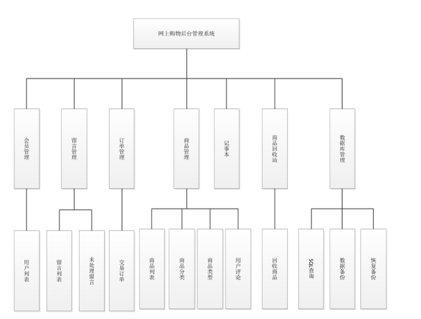
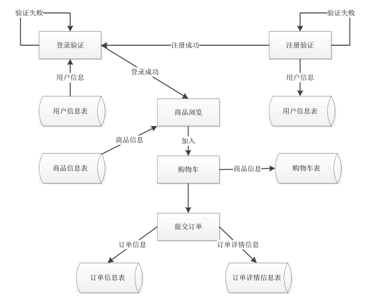

#  GameWorld游戏平台项目

## 第一章  绪论

### 1.1 研究背景

### 1.2 研究意义

### 1.3 研究内容

## 第二章  相关技术

### 2.1  Java

Java是一门[面向对象](https://baike.baidu.com/item/面向对象)编程语言，不仅吸收了[C++](https://baike.baidu.com/item/C%2B%2B)语言的各种优点，还摒弃了C++里难以理解的[多继承](https://baike.baidu.com/item/多继承)、[指针](https://baike.baidu.com/item/指针/2878304)等概念，因此Java语言具有功能强大和简单易用两个特征。Java语言作为静态面向对象编程语言的代表，极好地实现了面向对象理论，允许程序员以优雅的思维方式进行复杂的编程 [1] 。

Java具有简单性、面向对象、[分布式](https://baike.baidu.com/item/分布式/19276232)、[健壮性](https://baike.baidu.com/item/健壮性/4430133)、[安全性](https://baike.baidu.com/item/安全性/7664678)、平台独立与可移植性、[多线程](https://baike.baidu.com/item/多线程/1190404)、动态性等特点 [2] 。Java可以编写[桌面应用程序](https://baike.baidu.com/item/桌面应用程序/2331979)、[Web应用程序](https://baike.baidu.com/item/Web应用程序)、[分布式系统](https://baike.baidu.com/item/分布式系统/4905336)和[嵌入式系统](https://baike.baidu.com/item/嵌入式系统/186978)应用程序等 [3] 。

### 2.2  Javascript

JavaScript（简称“JS”） 是一种具有[函数](https://baike.baidu.com/item/函数/301912)优先的[轻量级](https://baike.baidu.com/item/轻量级/22359343)，解释型或即时编译型的[编程语言](https://baike.baidu.com/item/编程语言/9845131)。虽然它是作为开发Web页面的[脚本语言](https://baike.baidu.com/item/脚本语言/1379708)而出名的，但是它也被用到了很多非浏览器环境中，JavaScript 基于原型[编程](https://baike.baidu.com/item/编程/139828)、多范式的动态脚本语言，并且支持[面向对象](https://baike.baidu.com/item/面向对象/2262089)、命令式和声明式（如[函数式编程](https://baike.baidu.com/item/函数式编程/4035031)）风格。

### 2.3  SpringBoot

Spring Boot是由Pivotal团队提供的全新框架，其设计目的是用来简化新Spring应用的初始搭建以及开发过程。该框架使用了特定的方式来进行配置，从而使开发人员不再需要定义样板化的配置。通过这种方式，Spring Boot致力于在蓬勃发展的快速应用开发领域(rapid application development)成为领导者。

### 2.4  Vue

Vue 是一套用于构建用户界面的渐进式[JavaScript](https://baike.baidu.com/item/JavaScript/321142)框架。与其它大型框架不同的是，Vue 被设计为可以自底向上逐层应用。Vue 的核心库只关注视图层，方便与第三方库或既有项目整合。

### 2.5 mySQL

MySQL是一个**[关系型数据库管理系统](https://baike.baidu.com/item/关系型数据库管理系统/696511)，由瑞典MySQL AB 公司开发，属于 [Oracle](https://baike.baidu.com/item/Oracle) 旗下产品。MySQL 是最流行的[关系型数据库管理系统](https://baike.baidu.com/item/关系型数据库管理系统/696511)之一，在 WEB 应用方面，MySQL是最好的 [RDBMS](https://baike.baidu.com/item/RDBMS/1048260) (Relational Database Management System，关系数据库管理系统) 应用软件之一。

MySQL是一种关系型数据库管理系统，关系数据库将数据保存在不同的表中，而不是将所有数据放在一个大仓库内，这样就增加了速度并提高了灵活性。

MySQL所使用的 SQL 语言是用于访问[数据库](https://baike.baidu.com/item/数据库/103728)的最常用标准化语言。MySQL 软件采用了双授权政策，分为社区版和商业版，由于其体积小、速度快、总体拥有成本低，尤其是[开放源码](https://baike.baidu.com/item/开放源码/7176422)这一特点，一般中小型网站的开发都选择 MySQL 作为网站数据库。

### 2.6 tomcat

Tomcat是Apache 软件基金会（Apache Software Foundation）的Jakarta 项目中的一个核心项目，由[Apache](https://baike.baidu.com/item/Apache/6265)、Sun 和其他一些公司及个人共同开发而成。由于有了Sun 的参与和支持，最新的Servlet 和JSP 规范总是能在Tomcat 中得到体现，Tomcat 5支持最新的Servlet 2.4 和JSP 2.0 规范。因为Tomcat 技术先进、性能稳定，而且免费，因而深受Java 爱好者的喜爱并得到了部分软件开发商的认可，成为目前比较流行的Web 应用服务器。

Tomcat 服务器是一个免费的开放源代码的Web 应用服务器，属于轻量级应用[服务器](https://baike.baidu.com/item/服务器)，在中小型系统和并发访问用户不是很多的场合下被普遍使用，是开发和调试JSP 程序的首选。对于一个初学者来说，可以这样认为，当在一台机器上配置好Apache 服务器，可利用它响应[HTML](https://baike.baidu.com/item/HTML)（[标准通用标记语言](https://baike.baidu.com/item/标准通用标记语言/6805073)下的一个应用）页面的访问请求。实际上Tomcat是Apache 服务器的扩展，但运行时它是独立运行的，所以当你运行tomcat 时，它实际上作为一个与Apache 独立的进程单独运行的。

诀窍是，当配置正确时，Apache 为HTML页面服务，而Tomcat 实际上运行JSP 页面和Servlet。另外，Tomcat和[IIS](https://baike.baidu.com/item/IIS)等Web服务器一样，具有处理HTML页面的功能，另外它还是一个Servlet和JSP容器，独立的Servlet容器是Tomcat的默认模式。

## 第三章 系统设计

### 3.1 前台功能结构图

在功能结构图中，每个矩形框代表-一个功能模块。从层次上来讲，上层功能包括(或控制)下层功能，直线表示调用关系。在图4-1中，网上购物前台管理系统是通过调用用户注册、用户登录、商品浏览、商品搜索、购物车、留言评价、用户中心等子功能来实现的，图中所示第三层罗列了用户中心子模块则是通过调用查看订单，留言，商品评论，资金等子功能模块来实现的。

在图4-2中各个符号表示的含义和前台功能结构图的含义相同。表示的含义是:网上购物后台管理系统是通过调用会员管理，留言管理，订单管理，商品管理，记事本和数据库管理等功能来实现的。更进一步的，其中留言管理是通过调用查看留言列表和查看未处理留言两个子功能模块实现的，订单管理:是通过调用查看交易订单，设置订单的发货状态, .取消订单等子功能来实现的，商品管理是通过调用商品列表(及对商品的增删改查)，商品分类(及对商品分类的增删改查)，商品类型(及对商品类型的增删改查)，用户评论等子功能来实现的，数据库管理是通过调用sql查询、数据备份和数据恢复等功能来实现的。

如图所示，矩形表示处理，即能改变数据值或数据位置的加工或部件，例如程序、
人工加工等都是处理。圆柱形表示存储在磁鼓上的文件或数据库。箭头表示数据流，用来
连接其他符号，指明数据流动方向。

**需求分析**

角色1：游客

1、用例名：注册

2、用例名：查看商品信息

角色2：用户

1、用例名：登录

2、用例名：个人信息维护

3、用例名：查看商品信息

4、用例名：购物车管理

5、用例名：支付管理

6、用例名：在线客服

角色3：客服

1、用例名：登录

2、用例名：个人信息维护

3、用例名：查看商品信息

4、用例名：商品管理

5、用例名：用户管理

6、用例名：在线客服

7、用例名：订单管理

角色4：管理员

1、用例名：登录

2、用例名：个人信息维护

3、用例名：客服账号创建

4、用例名：客服名单维护

8、用例名：查看商品信息

9、用例名：商品管理

10、用例名：用户管理

11、用例名：订单管理

 

|      | 查看商品信息 | 登录 | 个人信息维护 | 购物车管理 | 支付管理 | 在线客服 | 用户管理 | 商品管理 | 订单管理 | 客服账号创建 | 客服名单维护 |
| ---- | ------------ | ---- | ------------ | ---------- | -------- | -------- | -------- | -------- | -------- | ------------ | ------------ |
| 游客 | 1            | 0    | 0            | 0          | 0        | 0        | 0        | 0        | 0        | 0            | 0            |
| 用户 | 1            | 1    | 1            | 1          | 1        | 1        | 0        | 0        | 0        | 0            | 0            |
| 客服 | 1            | 0    | 1            | 0          | 0        | 1        | 1        | 1        | 1        | 0            | 0            |
| 管理 | 1            | 1    | 1            | 1          | 1        | 1        | 1        | 1        | 1        | 1            | 1            |

 